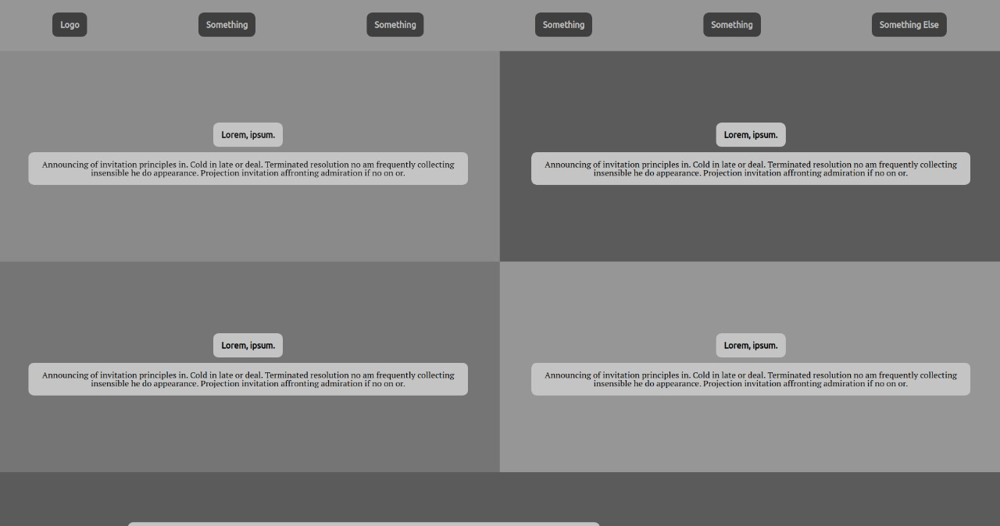

# Smashing Magazine

 The aim of this project is to play with background colors to achieve a heatmap of the [Smashing Megazine](https://www.smashingmagazine.com/) site.

## Demo Link

[Live Demo Link](https://raw.githack.com/epinczinger/smashing_magazine/design/index.html).

## Built With

- HTML5
- CSS3

## Authors

👤 **Elias**

- Github: [@e71az](https://github.com/e71az)
- Twitter: [@e71az](https://twitter.com/e71az)
- Linkedin: [linkedin](https://www.linkedin.com/in/elias-casta%C3%B1eda-17a771115/)

👤 **Esteban**

- Github: [@epinczinger](https://github.com/epinczinger)
- Twitter: [@epinczinger](https://twitter.com/epinczinger)
- Linkedin: [linkedin](https://www.linkedin.com/in/esteban-pinczinger-busai-ab49a254/?originalSubdomain=ar)

## 🤝 Contributing

Contributions, issues and feature requests are welcome!

Feel free to check the [Issue page](https://github.com/epinczinger/smashing_magazine/issues).

## Show your support

Give a ⭐️ if you like this project!

